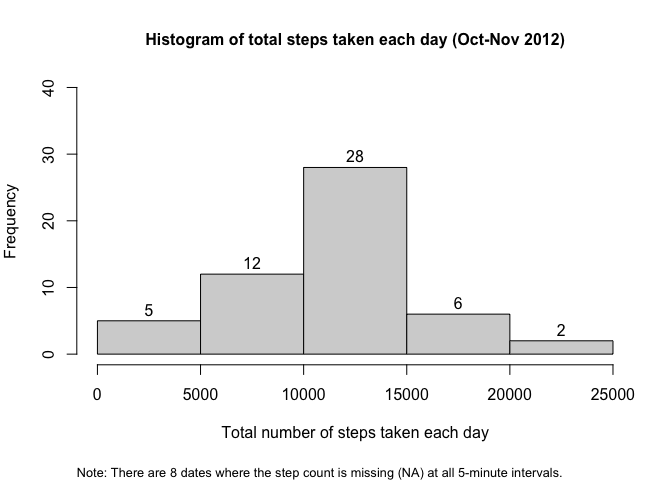
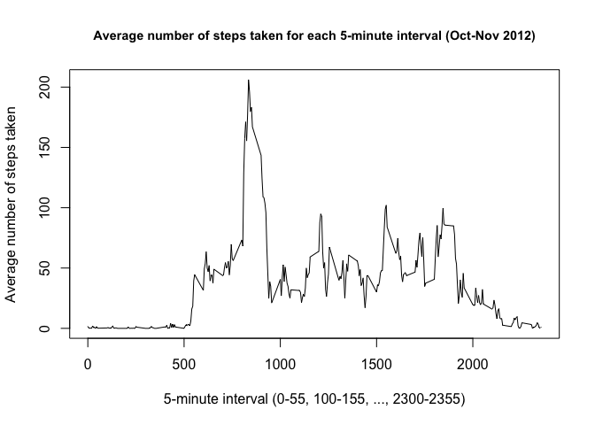
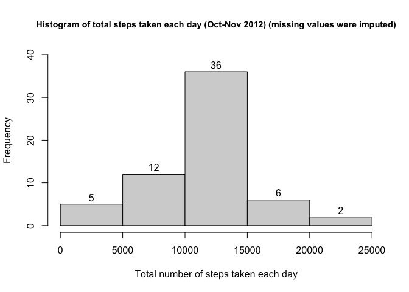
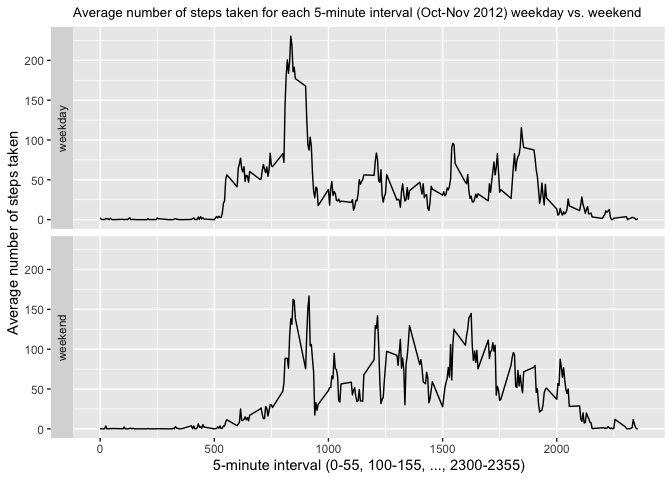

## Dataset and Assignment

It is now possible to collect a large amount of data about personal movement using activity-monitoring devices. These type of devices are part of the “quantified self” movement – a group of enthusiasts who take measurements about themselves regularly to improve their health, to find patterns in their behavior, or because they are tech geeks. But these data remain under-utilized both because the raw data are hard to obtain and there is a lack of statistical methods and software for processing and interpreting the data.

This assignment makes use of data from a personal activity-monitoring device. This device collects data at 5-minute intervals throughout the day. The data consist of two months of data from an anonymous individual collected during the months of October and November 2012 and include the number of steps taken in 5-minute intervals each day.  

Dataset: [Activity monitoring data](https://d396qusza40orc.cloudfront.net/repdata%2Fdata%2Factivity.zip) [52K]  

The dataset (17,568 observations) is stored in a comma-separated-value (CSV) file.  

The variables included in this dataset are:  
* steps: Number of steps taken in a 5-minute interval (missing values are coded as NA)  
* date: The date on which the measurement was taken in YYYY-MM-DD format  
* interval: Identifier for the 5-minute interval in which measurement was taken  

Note that there are a number of days/intervals where there are missing values (coded as NA). The presence of missing days may introduce bias into some calculations or summaries of the data.  

## Loading and preprocessing the data
First, download and unzip the data, read the data into R, and perform a date transformation.  


```r
#Download activity.zip file if it does not already exist in working directory
if(!file.exists("./activity.zip")){
  download.file("https://d396qusza40orc.cloudfront.net/repdata%2Fdata%2Factivity.zip",
                destfile = "./activity.zip")
}

#check to see if unzipped activity.csv file already exists. if not, unzip.
if(!file.exists("./activity.csv")){
  unzip(zipfile="activity.zip")
}

#read in data
act <- read.csv("./activity.csv",header=TRUE)
#transform date variable
act$date <- as.Date(act$date,"%Y-%m-%d")
```

Next, explore the data including the missing data.  


```r
#quick summary of data
str(act)
```

```
## 'data.frame':	17568 obs. of  3 variables:
##  $ steps   : int  NA NA NA NA NA NA NA NA NA NA ...
##  $ date    : Date, format: "2012-10-01" "2012-10-01" ...
##  $ interval: int  0 5 10 15 20 25 30 35 40 45 ...
```

```r
head(act)
```

```
##   steps       date interval
## 1    NA 2012-10-01        0
## 2    NA 2012-10-01        5
## 3    NA 2012-10-01       10
## 4    NA 2012-10-01       15
## 5    NA 2012-10-01       20
## 6    NA 2012-10-01       25
```

```r
summary(act) #note the missing step data!
```

```
##      steps             date               interval     
##  Min.   :  0.00   Min.   :2012-10-01   Min.   :   0.0  
##  1st Qu.:  0.00   1st Qu.:2012-10-16   1st Qu.: 588.8  
##  Median :  0.00   Median :2012-10-31   Median :1177.5  
##  Mean   : 37.38   Mean   :2012-10-31   Mean   :1177.5  
##  3rd Qu.: 12.00   3rd Qu.:2012-11-15   3rd Qu.:1766.2  
##  Max.   :806.00   Max.   :2012-11-30   Max.   :2355.0  
##  NA's   :2304
```

```r
library(dplyr)
```

```
## 
## Attaching package: 'dplyr'
```

```
## The following objects are masked from 'package:stats':
## 
##     filter, lag
```

```
## The following objects are masked from 'package:base':
## 
##     intersect, setdiff, setequal, union
```

```r
#investigate missing data by date:
act_na_bydt <- act %>%
  group_by(date) %>%
  summarize(n=n(),n_NA=sum(is.na(steps))) %>%
  mutate(allNA=(n==n_NA)) 
#allNA=TRUE if ALL step data are NA for a given date

#records with NA by date:
#act_na_bydt[which(act_na_bydt$n_NA>0),]

#total records with missing step count:
sum(act_na_bydt$n_NA)
```

```
## [1] 2304
```

```r
#total records with any missing data:
sum(!complete.cases(act))
```

```
## [1] 2304
```

```r
#total NA records where all step count data are missing for a given date:
sum(act_na_bydt[which(act_na_bydt$allNA==TRUE),]$n_NA)
```

```
## [1] 2304
```

```r
#note: missing step data exist for 8 dates and all step data are missing for these 8 dates

#number of dates with NA for all records:
DateAllNA <- length(which(act_na_bydt$allNA==TRUE))
#8 dates with missing values (all 5-min intervals are NA)

#row numbers with NA:
NArows <- which(!complete.cases(act))

#paste("Number of rows with NAs:", sum(!complete.cases(act)))
```


## What is mean total number of steps taken per day?
For this part of the assignment, you can ignore the missing values in the dataset.  
1. Calculate the total number of steps taken per day  
2. Make a histogram of the total number of steps taken each day  
3. Calculate and report the mean and median of the total number of steps taken per day  


```r
#frame with unique dates
q1dat_fr <- tibble(date=unique(act$date))

#remove NA records, calculate sum (total number of steps taken per day), then merge on unique dates
#some dates have NA for all step counts, so this adds those dates with NA for total number of steps taken
q1dat <- act %>% 
  filter(!is.na(steps)) %>%
  group_by(date) %>% 
  summarise(n=n(), sum=sum(steps)) %>%
  full_join(q1dat_fr) %>%
  arrange(date)
```

```
## Joining, by = "date"
```

```r
#dates where total step count is missing (NA) for all 5-min intervals (same as earlier derivations)
#nrow(q1dat[is.na(q1dat$sum),])==DateAllNA

#save default plotting settings
oldpar <- par(no.readonly = TRUE)

par(mar=c(6,4,4,2))
#Histogram of the total number of steps taken each day
hist(q1dat$sum,xlab="Total number of steps taken each day",ylim=c(0,40), 
     main="Histogram of total steps taken each day (Oct-Nov 2012)", cex.main=1, labels=TRUE)
#add footnote describing the missing data
mtext(paste("Note: There are", DateAllNA, 
            "dates where the step count is missing (NA) at all 5-minute intervals."),
      side=1,line=5,cex=0.8,adj=0)
```

<!-- -->

```r
par(oldpar)
```
Mean and median total number of steps taken per day:  


```r
sumq1 <- summary(q1dat$sum)
print(c(sumq1["Mean"], sumq1["Median"]))
```

```
##     Mean   Median 
## 10766.19 10765.00
```


## What is the average daily activity pattern?
1. Make a time series plot (i.e. type = "l") of the 5-minute interval (x-axis) and the average number of steps taken, averaged across all days (y-axis)  
2. Which 5-minute interval, on average across all the days in the dataset, contains the maximum number of steps?  


```r
#frame with interval (0-55, 100-155, etc.) and 1-288 (number of 5-min intervals in a day)
q2dat_fr <- tibble(interval=unique(act$interval), nint5=seq(1,24*60/5,by=1))
#Calculate the average number of steps taken for each 5-minute interval and remove NA records
q2dat <- act %>% 
  filter(!is.na(steps)) %>%
  group_by(interval) %>% 
  summarise(n=n(), mean=mean(steps)) %>%
  full_join(q2dat_fr) %>%
  arrange(interval)
```

```
## Joining, by = "interval"
```

```r
plot(q2dat$interval, q2dat$mean, type="l",
     xlab="5-minute interval (0-55, 100-155, ..., 2300-2355)",
     ylab="Average number of steps taken",
     main="Average number of steps taken for each 5-minute interval (Oct-Nov 2012)",
     cex.main=0.9)
```

<!-- -->

Which 5-minute interval contains the maximum number of steps?  


```r
paste0("5-minute interval with the maximum (", round(q2dat[which.max(q2dat$mean),]$mean,2), ") number of steps: ", q2dat[which.max(q2dat$mean),]$interval)
```

```
## [1] "5-minute interval with the maximum (206.17) number of steps: 835"
```

## Imputing missing values
1. Calculate and report the total number of missing values in the dataset (i.e. the total number of rows with NAs)
2. Devise a strategy for filling in all of the missing values in the dataset. The strategy does not need to be sophisticated. For example, you could use the mean/median for that day, or the mean for that 5-minute interval, etc.  
***Chosen imputation strategy: impute missing values by imputing the mean number of steps taken for that 5-minute interval.
3. Create a new dataset that is equal to the original dataset but with the missing data filled in.
4. Make a histogram of the total number of steps taken each day. Calculate and report the mean and median total number of steps taken per day. Do these values differ from the estimates from the first part of the assignment? What is the impact of imputing missing data on the estimates of the total daily number of steps?

```r
paste("Total number of missing values in the dataset (i.e. the total number of rows with NAs):",
      sum(!complete.cases(act)))
```

```
## [1] "Total number of missing values in the dataset (i.e. the total number of rows with NAs): 2304"
```


```r
#impute missing values by imputing mean number of steps taken for that 5-minute interval across all dates
#8 dates where all 288 5-min intervals were imputed
act_impute <- act
for(i in 1:nrow(act_impute)){
  if(is.na(act_impute[i,]$steps)){
    act_impute[i,]$steps <- q2dat[which(q2dat$interval == act[i,]$interval),]$mean
  }
}

#Make a histogram of the total number of steps taken each day 
q3dat <- act_impute %>% 
  group_by(date) %>% 
  summarise(n=n(), sum=sum(steps))

#imputed daily steps for the 8 dates with missing step counts:
print.data.frame(q3dat[which(act_na_bydt$allNA==TRUE),])
```

```
##         date   n      sum
## 1 2012-10-01 288 10766.19
## 2 2012-10-08 288 10766.19
## 3 2012-11-01 288 10766.19
## 4 2012-11-04 288 10766.19
## 5 2012-11-09 288 10766.19
## 6 2012-11-10 288 10766.19
## 7 2012-11-14 288 10766.19
## 8 2012-11-30 288 10766.19
```

```r
hist(q3dat$sum, xlab="Total number of steps taken each day", labels=TRUE, ylim=c(0,40),
     main="Histogram of total steps taken each day (Oct-Nov 2012) (missing values were imputed)", 
     cex.main=0.9)
```

<!-- -->

Post-imputation mean and median total number of steps taken per day:  


```r
sumq3 <- summary(q3dat$sum)
print(c(sumq3["Mean"],sumq3["Median"]))
```

```
##     Mean   Median 
## 10766.19 10766.19
```

Summary stats of total number of steps taken per day pre-imputation (withNA) and post-imputation (withoutNA):  

```r
(sumq1q3 <- rbind(withNA=sumq1, withoutNA=c(sumq3,0)))
```

```
##           Min. 1st Qu.   Median     Mean 3rd Qu.  Max. NA's
## withNA      41    8841 10765.00 10766.19   13294 21194    8
## withoutNA   41    9819 10766.19 10766.19   12811 21194    0
```
Do these values differ from the estimates from the first part of the assignment? What is the impact of imputing missing data on the estimates of the total daily number of steps?  
Yes - the median value changed but the mean did not. The impact of imputing missing data on the estimates of total daily number of steps is that you have 8 additional dates with the imputed mean number of steps taken for each 5-minute interval across all the other dates; this results in an imputed total step count of 10766.19, which is the mean daily step count. These 8 additional dates were included in the center of distribution which you can see in the histograms (N=28 to N=36 in the 10000-15000 category), and the median went from 10765.00 to 10766.19.  


## Are there differences in activity patterns between weekdays and weekends?
1. For this part the weekdays() function may be of some help here. Use the dataset with the filled-in missing values for this part. Create a new factor variable in the dataset with two levels – “weekday” and “weekend” indicating whether a given date is a weekday or weekend day.  
2. Make a panel plot containing a time series plot (i.e. type = "l") of the 5-minute interval (x-axis) and the average number of steps taken, averaged across all weekday days or weekend days (y-axis). See the README file in the GitHub repository to see an example of what this plot should look like using simulated data.  

During the weekdays, the average number of steps taken was higher in the morning (5-10 AM [x=500-1000]), peaked a bit around lunch time, and peaked again in the evening; this aligns with a 9-5 work schedule. During the weekend, more activity occurred throughout the day (starting around 8 AM [x=800] through about 9 PM [x=2100]).  


```r
#initialize weekday variable and then populate it
wday <- rep(NA,nrow(act_impute))
for(i in 1:nrow(act_impute)){
  wday[i] <- weekdays(act$date[i])
}
#factor variable for weekday vs. weekend
fwday <- factor(wday,
                levels=c("Monday","Tuesday","Wednesday","Thursday","Friday","Saturday","Sunday"),
                labels=c("weekday","weekday","weekday","weekday","weekday","weekend","weekend"))

#add both variables to dataset
act_impute_1 <- act_impute %>%
  mutate(wday=wday,fwday=fwday)

#Calculate the average number of steps taken for each 5-minute interval by weekday/weekend
q4dat <- act_impute_1 %>% 
  group_by(fwday, interval) %>% 
  summarise(n=n(), mean=mean(steps))
```

```
## `summarise()` has grouped output by 'fwday'. You can override using the `.groups` argument.
```

```r
# q4dat_sum_means <- q4dat %>%
#   group_by(fwday) %>% 
#   summarize(min = min(mean), max = max(mean), 
#             mean2 = mean(mean), q1= quantile(mean, probs = 0.25), 
#             median = median(mean), q3= quantile(mean, probs = 0.75),
#             sd = sd(mean)) %>%
#   mutate_if(is.numeric, round, digits=1) %>%
#   mutate(lab = paste0("mean=", mean2, ", sd=", sd,
#                       "\nmin=", min, ", max=", max, 
#                       "\nq1=", q1, ", median=", median, ", q3=", q3),
#          position=c(500,500)) %>% 
#   select(fwday, lab, position)

#make panel plot of average number of steps taken for each interval for weekday/weekend
library(ggplot2)
ggplot(q4dat, aes(interval, mean)) + 
  geom_line() + 
  facet_grid(fwday ~ ., switch="both") +
  labs(x="5-minute interval (0-55, 100-155, ..., 2300-2355)",
       y="Average number of steps taken",
       title="Average number of steps taken for each 5-minute interval (Oct-Nov 2012) weekday vs. weekend") +
  theme(plot.title=element_text(size=10)) #+
```

<!-- -->

```r
  #geom_text(data = q4dat_sum_means, aes(x=position, label = lab), y=Inf, hjust=1, vjust=1.2, size=3)
```
